# 🛒 Flutter E-Commerce App

A full-featured **E-Commerce mobile application** built using **Flutter** and **Firebase**, following the **MVC architecture**.  
This project was developed as part of my learning journey and academic work.

---

## 🚀 Features

### 👤 Authentication
- User Signup & Login
- Password Reset
- Secure authentication using Firebase Auth

### 🛍️ Products
- Product listing from Firestore
- Product details (image, price, description)
- Search products by name
- Filter by price (min / max)
- Sort by cheapest or most expensive

### 🛒 Cart & Orders
- Add / remove products from cart
- Quantity management
- Checkout system
- Order history per user (user segregation)

### ❤️ Wishlist
- Add / remove favorites
- Stored locally using SQLite
- User-specific wishlist

### 🔐 Admin Features
- Admin-only access
- Add new products
- Edit products
- Delete products
- Role-based UI visibility

---

## 🧱 Architecture

The project follows the **MVC (Model – View – Controller)** pattern:

```text
lib/
├── controllers/   # Business logic & Firebase handling
├── models/        # Data models (Product, Order, CartItem...)
├── views/         # UI screens (Home, Cart, Profile, Auth...)
├── utils/         # Helpers (auth utils, constants)
├── config/        # App configuration (admin config)
└── main.dart
````

---

## 🛠️ Tech Stack

* **Flutter**
* **Firebase Authentication**
* **Cloud Firestore**
* **SQLite (sqflite)**
* **Material UI**

---

## 📸 Screenshots

### 🔐 Authentication
| Login | Signup | Forgot Password |
|-------|--------|-----------------|
| 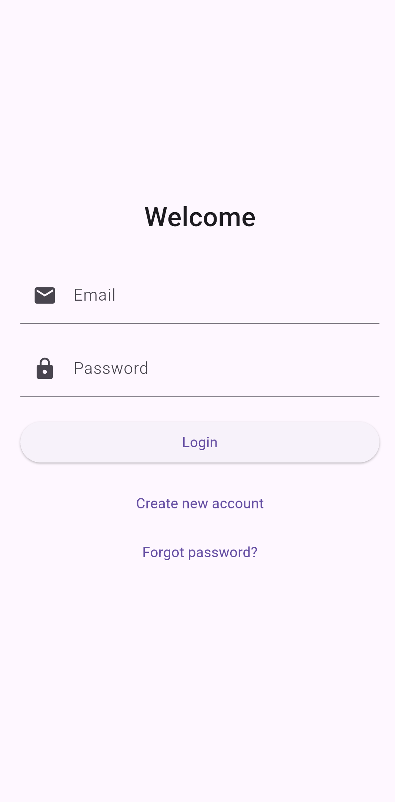 |  |  |

### 🏠 Shopping Flow
| Home | Product Detail | Cart |
|------|----------------|------|
| 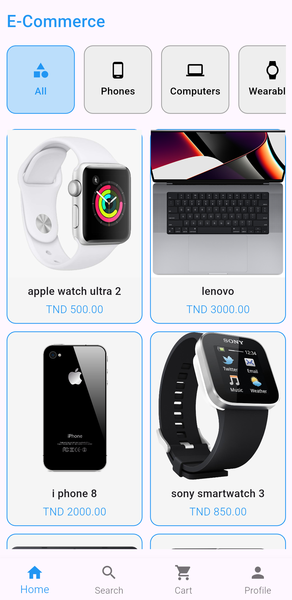 | 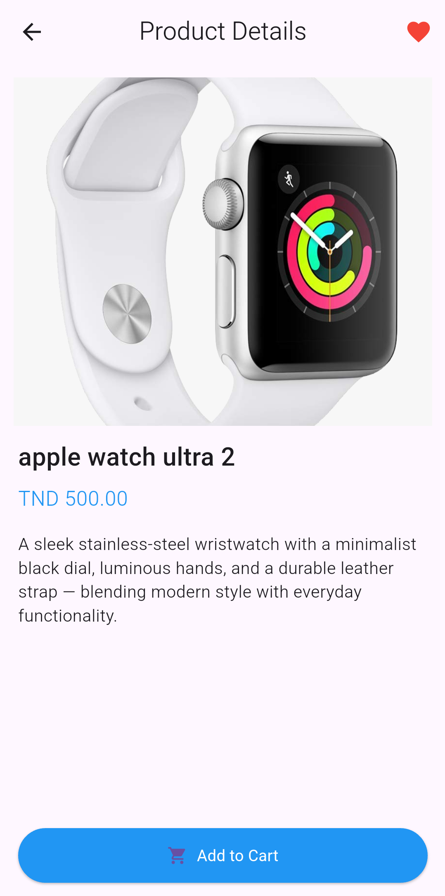 | 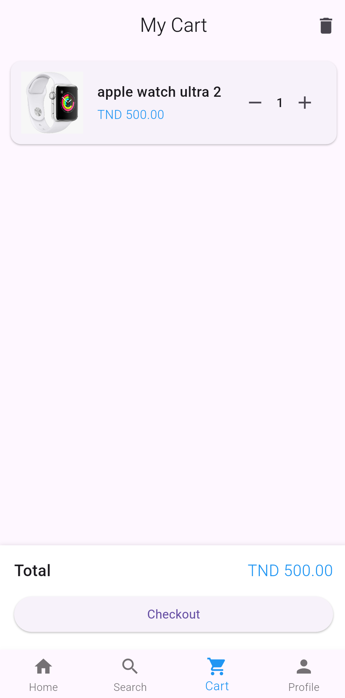 |

### 💳 Orders & Checkout
| Checkout | Orders | Wishlist |
|----------|--------|----------|
| 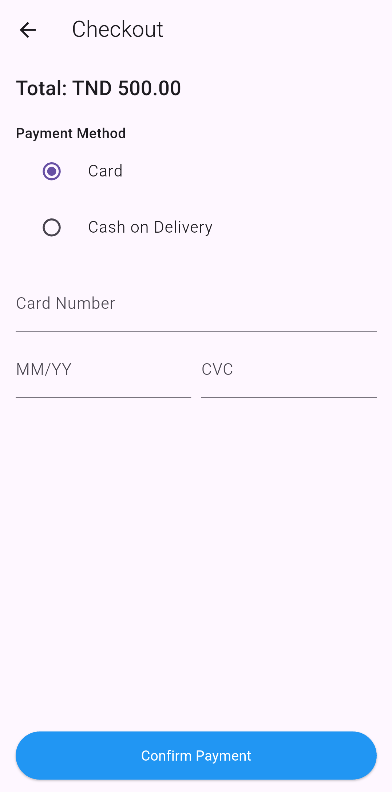 | 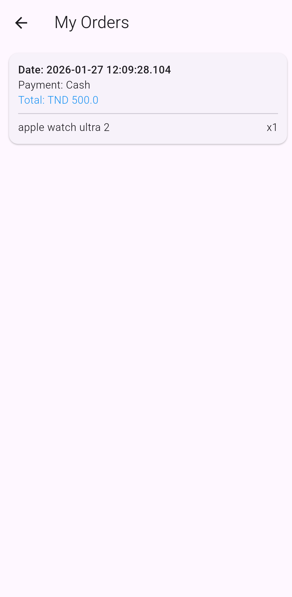 | 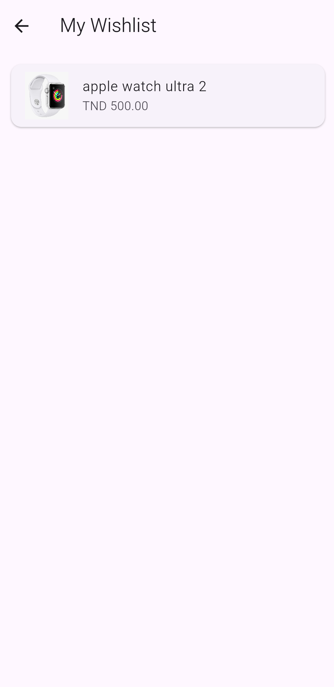 |

### 👤 Profile
| Client Profile |
|----------------|
| 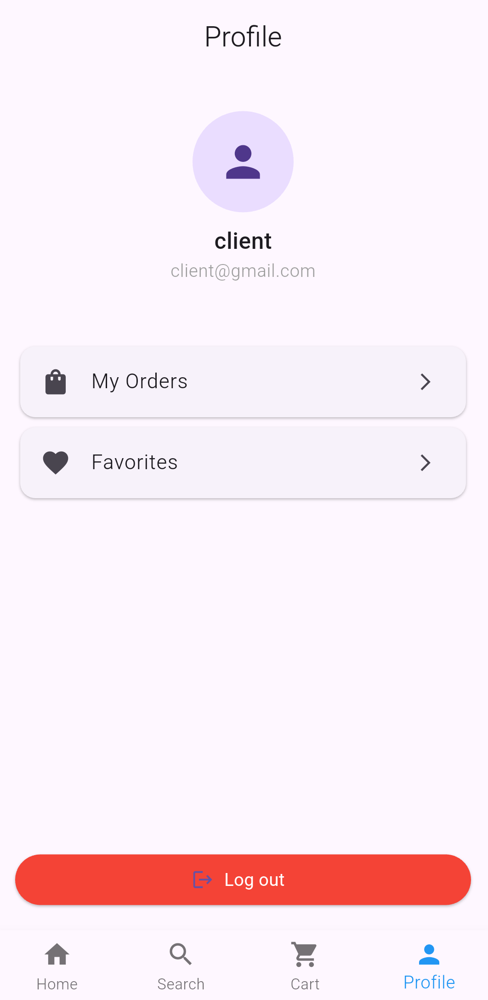 |

### 🔐 Admin Panel
| Admin Profile | Add Product | Manage Products |
|---------------|------------|-----------------|
| 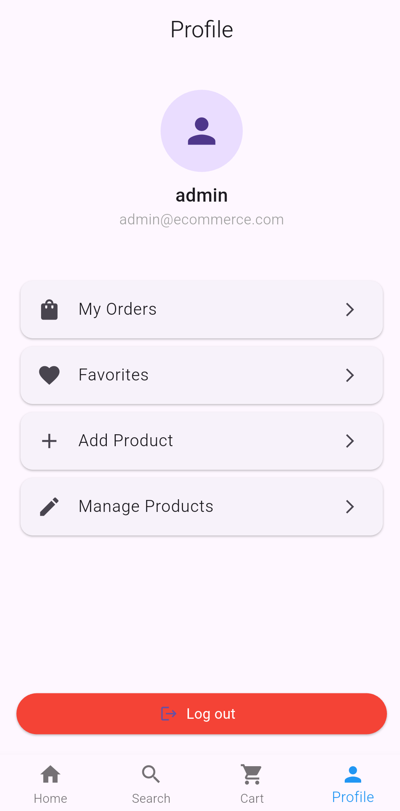 | 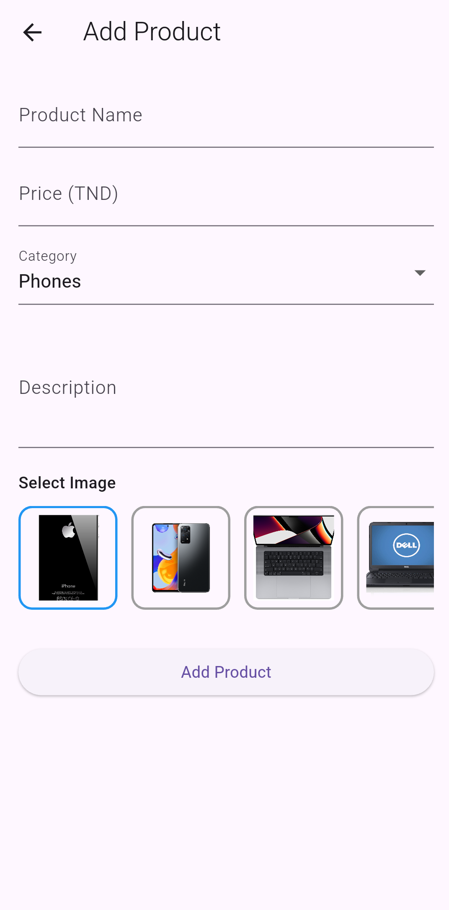 | 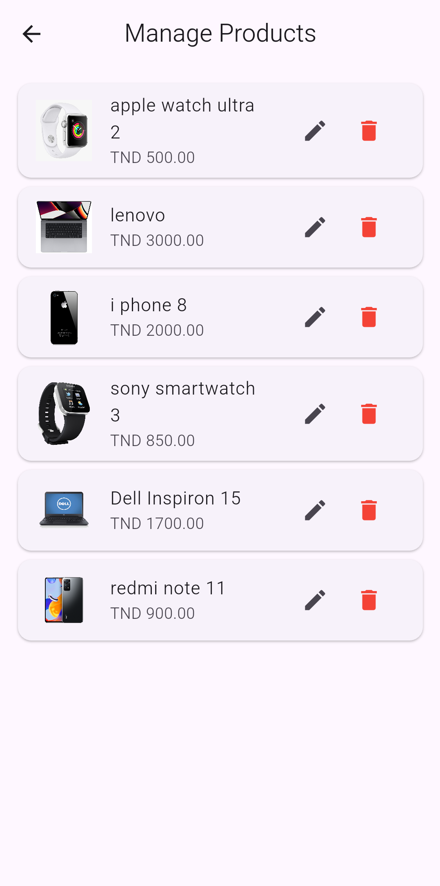 |

---

## 🧠 What I Learned

* Flutter UI & navigation
* State management using controllers
* Firebase APIs integration
* MVC architecture in Flutter
* User role management (Admin / User)
* Local storage with SQLite
* Error handling & UX best practices

---

## 📌 How to Run

1. Clone the repository:

```bash
git clone https://github.com/your-username/flutter_ecommerce_app.git
```

2. Install dependencies:

```bash
flutter pub get
```

3. Run the app:

```bash
flutter run
```

⚠️ Make sure Firebase is correctly configured before running the app.

---

## 🤝 Feedback

Feel free to open an issue or give feedback.
This project is part of my continuous learning journey 🚀

---

## 📫 Contact

* 🔗 LinkedIn: [https://linkedin.com/in/hassene-ghariani-cs](https://linkedin.com/in/hassene-ghariani-cs)
* 💻 GitHub: [https://github.com/HasseneGhariani](https://github.com/HasseneGhariani)
